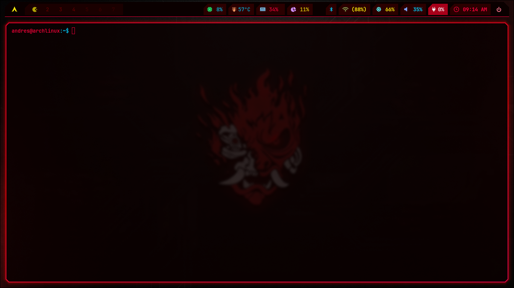
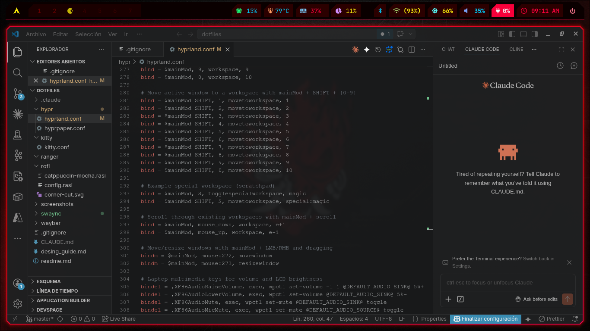
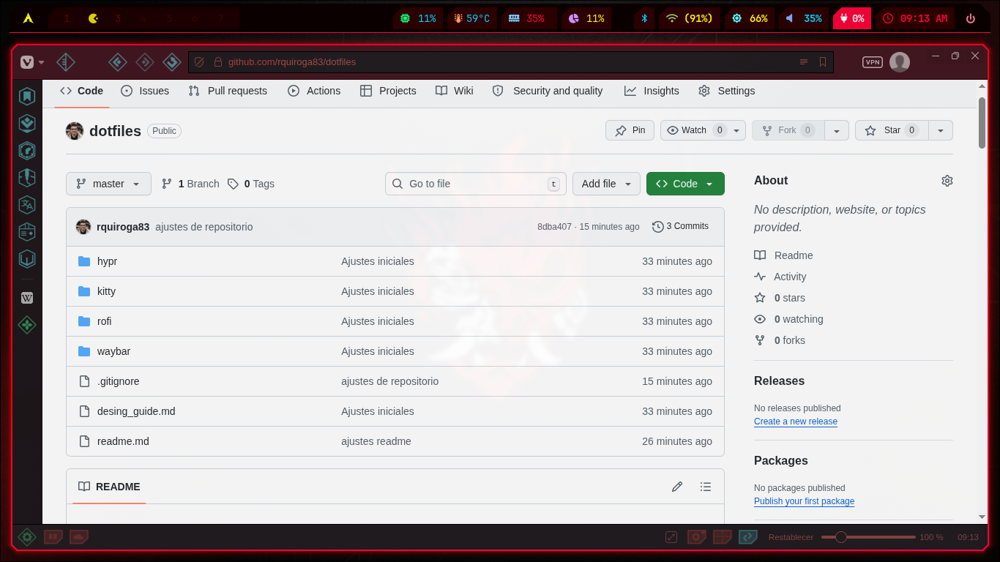

# Dotfiles — Cyberpunk Red

Configuración de escritorio Linux con tema **Cyberpunk Red**: fondos negros profundos, bordes neon rojo, amarillo y cyan, esquinas cortadas en diagonal y tipografía monoespaciada.







---

## Stack

| Componente | Software |
|---|---|
| Compositor (WM) | [Hyprland](https://hyprland.org/) |
| Barra de estado | [Waybar](https://github.com/Alexays/Waybar) |
| Lanzador de apps | [Rofi](https://github.com/davatorium/rofi) |
| Terminal | [Kitty](https://sw.kovidgoyal.net/kitty/) |
| Gestor de archivos (GUI) | Nautilus |
| Gestor de archivos (TUI) | [Yazi](https://yazi-rs.github.io/) |
| Editor | [Neovim](https://neovim.io/) |
| Fondo de pantalla | [Hyprpaper](https://github.com/hyprwm/hyprpaper) |
| Notificaciones | [SwayNC](https://github.com/ErikReider/SwayNotificationCenter) |
| Visualizador de audio | [Cava](https://github.com/karlstav/cava) |
| Discos externos | [udiskie](https://github.com/coldfix/udiskie) |

---

## Paleta de colores

| Token | Hex | Uso |
|---|---|---|
| `--bg-deep` | `#0a0000` | Fondo base (bar, ventanas, tooltips) |
| `--bg-module` | `#1a0000` | Superficies de módulos |
| `--bg-raised` | `#2b0000` | Módulos con contraste |
| `--red` | `#ff003c` | Acento principal (bordes, reloj, hover) |
| `--red-dark` | `#660000` | Estados críticos, sombras |
| `--yellow` | `#fcee0a` | Datos y estado (red, batería, disco) |
| `--cyan` | `#00cfff` | Métricas del sistema (CPU, audio, temp) |
| `--text-soft` | `#ffcccc` | Texto secundario (tooltips, menús) |

Regla de color: **rojo** = acción/crítico · **amarillo** = datos/estado · **cyan** = métricas del sistema

---

## Estructura

```
dotfiles/
├── hypr/
│   ├── hyprland.conf       # WM: layout, bordes, animaciones, atajos
│   ├── hyprpaper.conf      # Wallpaper
│   ├── hypridle.conf       # Idle / bloqueo de pantalla
│   └── scripts/            # Scripts para waybar y atajos
├── waybar/
│   ├── config.jsonc        # Módulos: CPU, RAM, disco, red, batería, reloj
│   ├── style.css           # Estilos: esquinas cortadas, animaciones
│   └── power_menu.xml      # Menú de apagado
├── kitty/
│   └── kitty.conf          # Terminal: colores, fuente, cursor, blur
├── rofi/
│   ├── config.rasi         # Configuración principal
│   ├── catppuccin-mocha.rasi  # Tema Cyberpunk Red (contenido Cyberpunk Red)
│   └── corner-cut.svg      # Efecto de esquina diagonal
├── nvim/
│   └── init.lua            # Configuración de Neovim (lazy.nvim)
├── yazi/
│   ├── yazi.toml           # Configuración principal
│   ├── keymap.toml         # Atajos de teclado
│   └── theme.toml          # Tema visual
├── udiskie/
│   └── config.yml          # Automontaje de discos externos
├── swaync/                 # Notificaciones
├── ranger/                 # Gestor de archivos CLI (legacy)
├── lsd/                    # ls moderno
├── util/
│   ├── bluetooth/btmenu    # Menú bluetooth (rofi)
│   ├── wifi/wifimenu       # Menú wifi (rofi)
│   └── udiskie/            # Scripts de gestión de discos externos
├── desing_guide.md         # Guía de diseño del sistema visual
└── readme.md
```

---

## Características principales

### Hyprland
- Layout **Dwindle** (tiling)
- Bordes activos: gradiente rojo (`#ff003c → #ff0000 → #ff0055`) a 45°
- Opacidad: activa 0.95 / inactiva 0.85
- Blur: tamaño 3, vibrancy 0.8
- Animaciones con curva `cyberSnappy`
- 10 workspaces con atajos `Super+1..0`

### Waybar
- Módulos izquierda: lanzador Rofi, workspaces, taskbar de ventanas, MPRIS, Cava
- Módulos centro: privacidad, monitor de discos externos (udiskie)
- Módulos derecha: Bluetooth, red, brillo, audio, batería, reloj, menú de poder
- Animación de workspace activo: blink amarillo 0.8s
- Efecto de esquina cortada en cada módulo (gradiente CSS 135°)

### Kitty
- Fuente: JetBrainsMono Nerd Font 10px
- Fondo con opacidad 0.88 y blur 32px
- Cursor rojo con trail y blink 0.5s

### Rofi
- Ventana 620×420px con esquina cortada (SVG polygon)
- Íconos Papirus · Modos: run, drun, window
- Texto seleccionado: fondo rojo + texto negro

---

## Instalación

Clonar e instalar con symlinks:

```bash
git clone https://github.com/rquiroga83/dotfiles.git ~/dotfiles
cd ~/dotfiles && bash install.sh
```

O manualmente con symlinks:

```bash
ln -s ~/dotfiles/hypr     ~/.config/hypr
ln -s ~/dotfiles/waybar   ~/.config/waybar
ln -s ~/dotfiles/kitty    ~/.config/kitty
ln -s ~/dotfiles/rofi     ~/.config/rofi
ln -s ~/dotfiles/nvim     ~/.config/nvim
ln -s ~/dotfiles/yazi     ~/.config/yazi
ln -s ~/dotfiles/udiskie  ~/.config/udiskie
ln -s ~/dotfiles/swaync   ~/.config/swaync
ln -s ~/dotfiles/lsd      ~/.config/lsd
```

### Dependencias (Arch Linux / pacman + AUR)

```bash
# Pacman
sudo pacman -S hyprland hyprpaper hypridle hyprlock waybar kitty \
               rofi-wayland swaync neovim yazi udiskie lsd \
               playerctl brightnessctl grim slurp wl-clipboard \
               wireplumber pipewire pipewire-pulse pavucontrol \
               bluez bluez-utils networkmanager btop

# AUR (yay / paru)
yay -S cava hyprshade wlogout
```

**Fuente requerida:**
```bash
yay -S ttf-jetbrains-mono-nerd
```

---

## Atajos de teclado

| Atajo | Acción |
|---|---|
| `Super+Q` | Abrir terminal (Kitty) |
| `Super+E` | Abrir gestor de archivos (Nautilus) |
| `Super+R` | Lanzador de apps (Rofi) |
| `Super+C` | Cerrar ventana activa |
| `Super+F` | Fullscreen |
| `Super+V` | Alternar flotante |
| `Super+M` | Menú de apagado |
| `Super+S` | Scratchpad (workspace especial) |
| `Super+1..0` | Cambiar workspace |
| `Super+Shift+1..0` | Mover ventana a workspace |
| `Super+Flechas` | Navegar entre ventanas |
| `Super+Shift+P` | Captura de pantalla (portapapeles) |
| `XF86Audio*` | Control de volumen / micrófono |
| `XF86Brightness*` | Control de brillo |
| `XF86Media*` | Reproducción de media |

---

## Diseño

Ver [desing_guide.md](desing_guide.md) para la especificación completa del sistema visual: paleta, tipografía, espaciado, animaciones y recetas por componente.
